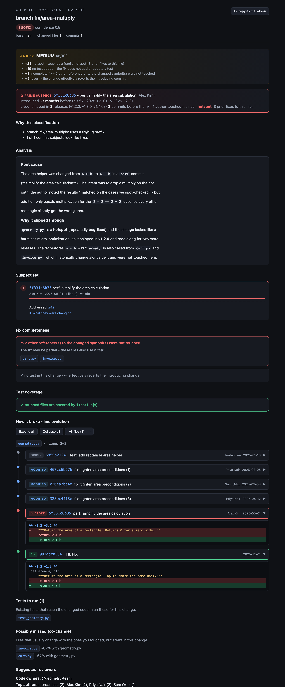

# culprit

[](https://github.com/noordeen123/culprit/actions/workflows/ci.yml)
[](https://pypi.org/project/culprit/)
[](https://pypi.org/project/culprit/)
[](LICENSE)

Root-cause analysis for a pull request or branch.

`culprit` looks at a PR (or the current branch), decides whether it's a **bugfix**
or a **feature**, then:

- **Bugfix** -> reconstructs the bug's life story. It blames the lines the fix
  removed/changed at the base revision to rank the commits that introduced it (the
  **suspect set**), surfaces what the author was *trying* to do (the introducing
  PR/commit + any linked issue), how long it lived and which **releases shipped it**,
  whether the file is a recurring **hotspot**, and whether the fix is actually
  complete (other untouched call sites, a missing test, a revert) - then explains
  why it broke.
- **Feature** -> maps the **blast radius**: who imports the changed modules, which
  tests cover them, and which touched files live in high-risk shared/core areas.

It is **read-only** - it never modifies your repo or the PR.

## Example

The visual report (`rca --html report.html`) for a bugfix - a one-line area formula
silently broken by a `perf` commit and shipped across three releases before it was
fixed. Top to bottom: the **QA risk score** with its factors, the introducing commit's
**intent** (+ linked issue), the **line-evolution timeline** (created -> reformatted ->
**broke (red)** -> **fix (green)**), the **tests to run**, the **co-change** files you
may have missed, and **suggested reviewers**.



A self-contained HTML file (no server, no CDN) with deep links, the introducing
PR's intent, a lifecycle strip (how long it lived and the releases that shipped it),
a fix-completeness callout, a test-gap callout, and expandable per-step diffs.

## Why the split design

The deterministic git work (diff parsing, `git blame` / `git log -L`, the
suspect set, the reverse-import map) lives in a plain Python engine that emits
**structured JSON**. The only LLM step - the "why it broke" narrative - is
isolated behind a `ReasoningAdapter`:

- **HarnessAdapter** - used by the Claude Code skill. Returns the structured
  result + a markdown skeleton; the agent writes the narrative. No API key.
- **ClaudeAPIAdapter** - used standalone. Calls the Claude API
  (`claude-opus-4-8` by default, `--fast` -> `claude-sonnet-4-6`).

Same engine, two frontends.

## How it works

Everything runs off **one normalized context** (`ctx`) and produces **one structured
result** (JSON). Each step is a small, deterministic module that reads git and writes a
slice of that result; the only optional, non-deterministic step is the LLM narrative.

```
  PR / branch ---.
  stack trace ---+--> pr_context  -->  ctx  (diff, changed files, commits, host links)
                          |
                          v
                    classify   (bugfix vs feature, with evidence)
                   /                                  \
          bugfix  v                                    v  feature
   suspect   (blame the lines the fix removed)     blast_radius
     -> evolution     (how the line evolved)        (who imports the changed code,
     -> intent / lifecycle / completeness            covering tests, high-risk modules)
     -> test_gap
                   \                                  /
                    v                                v
                  report.build  -->  QA risk score
                          |
            + test_impact . coupling . owners . coverage
                          |
                          v
   reasoning (optional LLM "why")  -->  output:
      JSON  |  HTML report  |  markdown  |  --select-tests  |  --fail-on (CI exit code)
```

1. **Resolve** the target into `ctx` - `pr_context` tries `gh`, then the GitHub/GitLab
   REST API, then plain local git; `--trace` instead turns stack frames into a synthetic
   diff so the *same* pipeline can run on a crash.
2. **Classify** bugfix vs feature from branch/label/title/commit signals.
3. **Analyze** down one path: a bugfix gets the suspect set, line-evolution timeline, and
   the "bug's life story" (intent, lifecycle, completeness); a feature gets the blast radius.
4. **Score & augment** - `report.build` rolls the signals into a QA risk score, then test
   impact, co-change, reviewers, and (optional) coverage are attached.
5. **Render** - the structured result becomes JSON, a self-contained HTML report, markdown,
   a test list, or a CI exit code. The LLM "why" is the only step that needs a key.

Every step is **read-only** (`git status` is unchanged after any run) and **repo-agnostic**
(no hardcoded paths/hosts). For the full module map and data shapes, see
[`docs/ARCHITECTURE.md`](docs/ARCHITECTURE.md).

## Install

```bash
pip install culprit            # engine + CLI (rca / culprit)
pip install "culprit[api]"     # + Claude API reasoning layer (anthropic SDK)
```

Or with [pipx](https://pipx.pypa.io) for an isolated CLI: `pipx install culprit`.
From source: `pip install -e ".[dev]"` then `pytest`.

PR metadata uses the GitHub CLI when available: `brew install gh && gh auth login`.
For **public repos you don't even need `gh`** - `rca --pr N` falls back to the
unauthenticated REST API (**GitHub and GitLab**) for metadata plus a read-only
`git fetch` of the PR/MR head (set `GITHUB_TOKEN` / `GITLAB_TOKEN` to raise rate
limits). With neither, culprit uses local git (base vs head) - fully offline,
minus PR title/labels.

### Any host, any language

- **Hosts:** deep links (commit / PR / file) are generated for **GitHub, GitLab,
  Bitbucket, and Gitea**; the suspect-set + line-evolution timeline work on *any*
  git repo regardless of host. For a self-hosted forge the URL can't disambiguate,
  so set `host = "gitlab"` (or `github`/`bitbucket`/`gitea`) in `.culprit.toml`, or
  `CULPRIT_HOST`.
- **Languages:** suspect/timeline are language-agnostic (pure `git blame`/`log -L`).
  Blast-radius + test-gap detect imports across JS/TS, Python, Go, Java/Kotlin,
  Ruby, C/C++, C#, PHP, Rust, Scala, Swift (quoted *and* bare/dotted import forms).

## Usage

```bash
rca                      # current branch vs the configured base (or latest commit)
rca --last               # just the latest commit ("the change I just made")
rca --pr 16786           # a specific GitHub PR (uses the PR's own base)
rca --repo /path --base main
rca --mode api --fast    # standalone reasoning via the Claude API
rca --json               # structured result only
rca --html report.html --open   # self-contained visual report (timeline UI)
rca --pr 16889 --bisect "pytest tests/test_x.py::test_y"   # confirm the suspect via git bisect
rca --pr 16889 --fail-on high   # QA gate: exit non-zero when risk is high (for CI)
rca --select-tests              # print the tests to run for this change (CI-pipeable)
rca --trace crash.txt           # RCA from a stack trace (no fix/PR/test needed)
```

## More than a smarter `git bisect`

`git bisect` finds one introducing commit *after* you already have a reliable failing
test. culprit is a **QA tool** that also works *before* a bug ships and *from a symptom*:

- **QA risk score + gate** - one explainable score over test gap, fix completeness,
  hotspot recurrence, blast radius, and churn; `--fail-on high` gates CI (see above).
  Pass `--coverage <lcov|cobertura>` to replace the import heuristic with ground truth -
  it pinpoints exactly which changed lines are uncovered.
- **Test impact analysis** - `--select-tests` lists the existing tests that reach the
  changed code (direct + transitive via the reverse-import graph). Pipe it:
  `pytest $(rca --select-tests)`.
- **RCA from a stack trace** - `rca --trace crash.txt` (or `... --trace -` from stdin)
  parses a Python / JS / Java / Go trace, resolves the frames to repo files, and blames
  the crashing lines to a suspect commit - **no fix, PR, or failing test required**.
- **Predictive signals** - **co-change** flags a file that usually changes with the ones
  you touched but is missing here ("did you forget X?"); **reviewer suggestions** come
  from `CODEOWNERS` + git authorship.

All of this is read-only and ships in the same self-contained HTML report.

## QA risk score

Every report carries a single **QA risk score** (0-100, `low`/`medium`/`high`) that
combines the signals culprit already computes - test gap, fix completeness, hotspot
recurrence, blast radius, churn - into one explainable number, with the contributing
factors listed (no ML, fully deterministic). `--fail-on {low,medium,high}` makes culprit
exit non-zero when the level meets or exceeds the threshold, so it can act as a **CI
quality gate**.

## Use in CI (GitHub Actions)

culprit runs as a **read-only QA gate**: it generates the HTML report as a build artifact
and signals risk via the **exit code** - it never comments on or writes to the PR. Copy
[`examples/github-actions/culprit-pr.yml`](examples/github-actions/culprit-pr.yml) into
`.github/workflows/`:

```yaml
- uses: actions/checkout@v4
  with: { fetch-depth: 0 }          # full history for blame / git log -L
- uses: actions/setup-python@v5
  with: { python-version: "3.12" }
- run: pip install culprit
- env: { GH_TOKEN: "${{ github.token }}" }   # read-only PR metadata
  run: rca --pr ${{ github.event.pull_request.number }} --html culprit-report.html --no-save --fail-on high
- if: always()
  uses: actions/upload-artifact@v4
  with: { name: culprit-report, path: culprit-report.html }
```

The job fails only when the QA risk is `high`; the report is uploaded either way. To gate
in any other CI, run `rca ... --fail-on high` and check the exit status.

## culprit vs `git bisect`

Same goal - find the commit that introduced a bug - but opposite method:

| | `git bisect` | culprit |
|---|---|---|
| Method | *Dynamic* - checks out commits and **runs a test** at each | *Static* - blames the fix's lines + `git log -L` |
| Needs a failing test? | **Required** | No |
| Runs your code? | Yes (serial checkouts) | No |
| Speed | Minutes (~log2(N) runs) | Instant |
| Answers | "first commit where the test fails" | suspect + **how the line evolved** + *why* + the introducing PR's intent + releases shipped + hotspot + fix completeness + test gap |
| Confidence | Proof (if the test is reliable) | Strong heuristic |

culprit is **not** a reimplementation of bisect - it reasons statically from the
patch and gives you the *story*, no test required. But when you *do* have a repro,
`--bisect "<cmd>"` runs a real bisect (in a **throwaway git worktree**, so your
checkout and `HEAD` are never touched) and stamps **"✓ confirmed by git bisect"**
when the first failing commit matches the blamed suspect. The command must exit
non-zero when the bug is present; `--good <ref>` / `--bad <ref>` override the
search bounds (defaults: the suspect's parent and the base).

### Visual HTML report

`--html PATH` writes a **single self-contained HTML file** (inline CSS/JS, data
embedded, no CDN - opens offline, shareable, CI-attachable). For a bugfix it
renders a **line-evolution timeline**: for each line the fix touched, every commit
that ever changed those lines, from creation -> ... -> **the commit that broke it
(red)** -> **the fix (green)**, each step expandable to its diff.

```bash
rca --pr 16889 --html rca.html --open                 # narrative via --mode api if key set
rca --pr 16889 --html rca.html --narrative-file why.md # embed a pre-written narrative
```

The timeline needs no API key. The "Analysis" prose comes from `--narrative-file`
(e.g. written by the Claude Code `/rca` skill) or from `--mode api`.

The report also includes: a **TL;DR banner** naming the prime suspect with a
**lifecycle strip** (how long the bug lived and the releases that shipped it); the
introducing PR's **intent** (title, linked issue, message body) on the suspect card;
a **fix-completeness** callout (other untouched references to the changed symbols,
whether a test was added, revert detection); **deep links** on every commit / PR /
file (derived from `origin`); **weight bars** ranking the suspects; **expand/collapse-all**
and a **per-file filter** for the timeline; and a one-click **copy-as-markdown** to
paste into the PR.

### Choosing the base branch

The base differs per repo (`main`, `master`, `develop`, a long-lived release
branch, ...). Resolution order:
`--base <ref>` -> `CULPRIT_BASE` env -> `.culprit.toml` (`base = "..."`) -> the latest
commit. The static HTML report is generated for one base (shown in the footer with a
regenerate hint). For an **interactive base picker**, use `serve` mode:

```bash
rca serve --repo /path/to/repo     # opens http://127.0.0.1:8722
```

It launches a local web app (stdlib only - no extra deps) with a form: enter a
PR/branch, **pick the base from a dropdown** (pre-filled from `.culprit.toml`,
the repo's default branch, then all local/remote branches), choose
classification + reasoning, and run a fresh analysis that renders the same visual
report. The base picker repopulates when you point it at a different repo. Binds
to localhost only.

### Base branch

In local mode (no PR), culprit needs a base to diff against. Resolution order:

1. `--base <ref>` on the CLI
2. `CULPRIT_BASE` environment variable
3. `base = "..."` in a `.culprit.toml` at the repo root
4. otherwise the latest commit (`HEAD~1`)

So pin your repo's real base once and forget it:

```toml
# .culprit.toml
base = "origin/main"   # whatever your repo is actually cut from
```

`--last` always forces the latest-commit view regardless of config.

## Tests

```bash
pip install -e ".[dev]" && pytest
```
