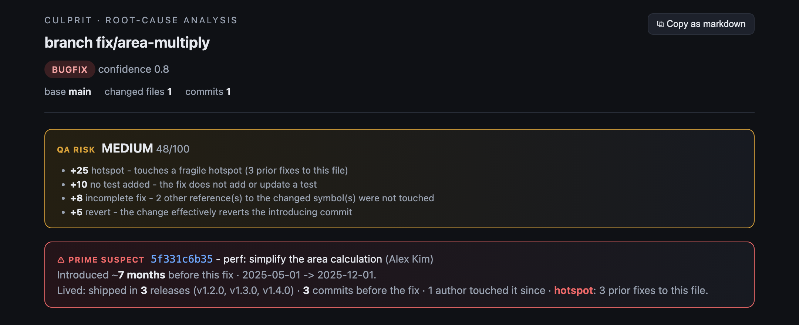
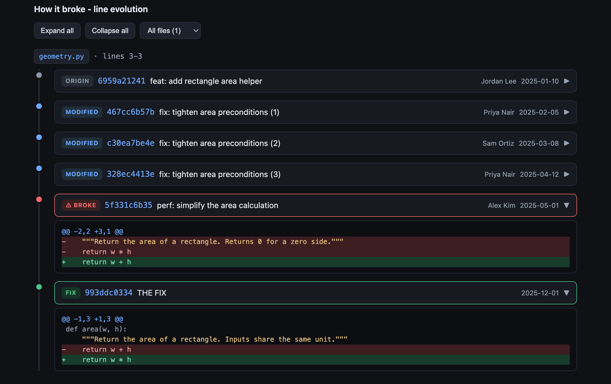

# culprit

<!-- mcp-name: io.github.noordeen123/culprit -->

<p align="center">
  <a href="https://github.com/noordeen123/culprit/actions/workflows/ci.yml"></a>
  <a href="https://pypi.org/project/culprit/"></a>
  <a href="https://pypi.org/project/culprit/"></a>
  <a href="LICENSE"></a>
</p>

<p align="center">
  <b>Root-cause analysis for agent-driven development.</b><br>
  Your coding agent finds what introduced a bug, and verifies its own fix is complete before it commits.
</p>

<p align="center">
  <a href="#quick-start">Quick start</a> ·
  <a href="#the-tools">Tools</a> ·
  <a href="#accuracy">Accuracy</a> ·
  <a href="docs/ARCHITECTURE.md">Architecture</a> ·
  <a href="https://registry.modelcontextprotocol.io/v0.1/servers?search=io.github.noordeen123/culprit">MCP registry</a>
</p>

<p align="center">
  
  <br>
  <em>A real run. The fix patched one caller of <code>parse_config</code> and missed two, so it scores <code>partial</code>.</em>
</p>

## Highlights

- ⚡️ **Instant root cause.** No test runs, no bisect. Blames the fix's own lines back through refactors.
- ✅ **`verify_fix` gate.** Tells an agent if its patch is `complete`, `partial`, or `risky`, before commit.
- 🔌 **MCP-native.** 11 tools over stdio, on the official MCP registry. One-command Claude Code plugin.
- 📊 **Benchmarked.** 50 real regressions from git and systemd. Reproducible, not a vibe.
- 🔒 **Read-only and offline.** Never writes to your repo or PR. No API key, no network.
- 🧠 **Structured output.** JSON grounded in git, so an agent reasons over facts instead of guessing.
- 🗣️ **Language-agnostic.** Suspects work anywhere git does. Blast radius reads 12 language families.

## Why an agent needs this

An agent is good at writing a patch and bad at knowing whether the patch is **done**.
It cannot see that the helper it just changed has three other callers, or that the bug
it is fixing was introduced by a refactor two years ago.

culprit answers both from git history:

| The agent asks | culprit answers |
|---|---|
| "What introduced this bug?" | Ranked suspect commits, the author's intent, the releases it shipped in |
| "Is my fix complete?" | `verify_fix`: missed call sites, whether a test shipped, a risk level |
| "What could this change break?" | Reverse-import dependents, covering tests, high-risk shared modules |

## Quick start

**Claude Code plugin** (installs the MCP server plus a skill that tells the agent when to use it):

```bash
/plugin marketplace add noordeen123/culprit
/plugin install culprit@culprit
```

**Any MCP client** (Cursor, Windsurf, VS Code, Codex CLI, Zed, Continue, Cline, Amazon Q, Goose):

```json
{
  "mcpServers": {
    "culprit": {
      "command": "uvx",
      "args": ["--from", "culprit[mcp]", "culprit-mcp"]
    }
  }
}
```

**CLI**, no agent required:

```bash
uvx culprit                     # run from PyPI on demand
rca --verify-fix patch.diff     # exit 0 if complete, 1 otherwise
```

Needs Python 3.10+ and [uv](https://docs.astral.sh/uv/) for the MCP server. The CLI runs on 3.9+.

## The tools

| Tool | What it answers |
|---|---|
| `analyze` | Full RCA in one call: classify, suspects or blast radius, risk, test impact |
| `verify_fix` | Is this diff safe to commit? `complete` / `partial` / `risky`, plus the missed call sites |
| `find_suspects` | Rank the commits that introduced the bug |
| `check_completeness` | Call sites of the changed symbol the fix did not touch |
| `get_intent` | The introducing commit's message, linked PR, referenced issues |
| `get_evolution` | Per-commit history of the buggy lines via `git log -L` |
| `get_risk_score` | QA gate score (0 to 100, low/medium/high) with contributing factors |
| `get_blast_radius` | Feature impact: dependents, covering tests, high-risk files |
| `get_test_impact` | Minimal test set to run for this change |
| `classify_change` | Bugfix vs feature, with evidence |
| `from_trace` | RCA straight from a stack trace, no diff or PR needed |

## verify_fix, the pre-commit gate

The agent runs this on its own diff before committing:

- **`verdict`**: `complete` when no untouched call site is left behind, `partial` when one was
  missed, `risky` when risk is high. The verdict is the completeness axis; test coverage is
  the separate confidence axis on `risk_level`.
- **`untouched_references`**: the exact files that still use the changed symbol. This is the
  list the agent goes and patches.
- **`skipped_symbols`**, **`adds_test`**, **`notes`**: what was too widely used to check, whether
  a test shipped, and what to do next.

Loop until `complete`, then commit. That is the whole idea.

## Accuracy

Benchmarked against 50 real regressions, 25 from [git](https://github.com/git/git) and 25 from
[systemd](https://github.com/systemd/systemd), where the introducing commit is known from each
fix's `Fixes:` trailer (author-verified ground truth). Given only the fix commit, culprit blames
the removed lines to rank the commits that introduced the bug.

| Metric | Result |
|---|---|
| Introducing commit ranked #1 | **50%** (25/50) |
| Introducing commit in the top-5 suspect set | **66%** (33/50) |

Deterministic and offline, on large C codebases the engine has never seen. Reproduce with
`python benchmarks/run.py`, which clones the repos and scores every case.

## CLI and CI

```bash
rca                            # current branch vs the configured base
rca --last                     # the latest commit only
rca --pr 16786                 # a specific PR (uses the PR's own base)
rca --trace crash.txt          # RCA from a stack trace, no fix or PR needed
rca --verify-fix patch.diff    # check a diff before committing
rca --select-tests             # print the tests to run for this change
rca --html report.html --open  # a single self-contained HTML report
rca --pr 16889 --fail-on high  # exit non-zero when QA risk is high
rca serve --repo /path         # local web UI with a base picker
```

**CI gate**: risk via exit code only, no PR comments, no writes. Copy
[`examples/github-actions/culprit-pr.yml`](examples/github-actions/culprit-pr.yml) into
`.github/workflows/`:

```yaml
- run: pip install "culprit>=0.3.0"
- env: { GH_TOKEN: "${{ github.token }}" }
  run: rca --pr ${{ github.event.pull_request.number }} --fail-on high
```

## HTML report

`--html` writes one self-contained file. No CDN, opens offline, attaches to CI. It opens with the
verdict: a scored QA risk with the factors behind it, and the prime suspect with how long the bug
lived.

<p align="center">
  
</p>

Then it reconstructs how the bug got there. Every commit that touched the buggy line, from
creation through the commit that broke it (red, with the exact diff) to the fix (green):

<p align="center">
  
</p>

<p align="center"><em>Every node expands to its diff. <a href="docs/report.png">See the full report</a>.</em></p>

## vs `git bisect`

| | `git bisect` | culprit |
|---|---|---|
| Input | A reliable failing test | The fix diff (or a stack trace) |
| Method | Checks out commits and runs the test | Blames the fix's lines plus `git log -L` |
| Speed | Minutes (about log2(N) test runs) | Instant |
| Output | First bad commit | Suspect set, intent, lifecycle, completeness, risk |
| Confidence | Proof | Strong heuristic |

`--bisect "<cmd>"` runs a real bisect as an optional confirmation layer, in a throwaway
`git worktree` so your checkout is never touched. When the first failing commit matches the
blamed suspect, the report stamps it **confirmed by git bisect**.

## Architecture

One normalized context in, one structured JSON result out. The only non-deterministic step
is the optional LLM narrative, isolated behind an adapter so the engine runs with no API key.

<p align="center">
  <picture>
    <source media="(prefers-color-scheme: dark)" srcset="docs/workflow-dark.svg">
    
  </picture>
</p>

Two lanes, one engine. Every module writes one slice of the result, so nothing cares whether
the target came from `gh`, the REST API, local git, or a pasted stack trace. Full module map:
[`docs/ARCHITECTURE.md`](docs/ARCHITECTURE.md).

## Configuration

The base branch resolves in order: the `--base` flag, then `CULPRIT_BASE`, then `.culprit.toml`
(`base = "origin/main"`), then `HEAD~1`. `--last` forces the latest-commit view.

PR titles and labels use the GitHub CLI when present, or the unauthenticated REST API for public
repos (set `GITHUB_TOKEN` or `GITLAB_TOKEN` to raise limits). Deep links cover GitHub, GitLab,
Bitbucket, and Gitea. Blast radius reads imports across JS/TS, Python, Go, Java/Kotlin, Ruby,
C/C++, C#, PHP, Rust, Scala, and Swift.

## Contributing

```bash
pip install -e ".[dev]" && pytest
```

Module map and data shapes: [`docs/ARCHITECTURE.md`](docs/ARCHITECTURE.md). Publishing the MCP
server to the registries: [`docs/PUBLISHING.md`](docs/PUBLISHING.md). MIT licensed.
