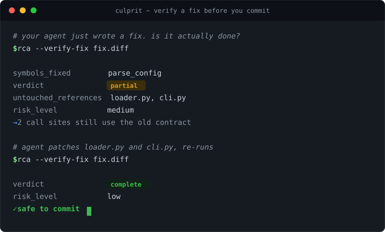
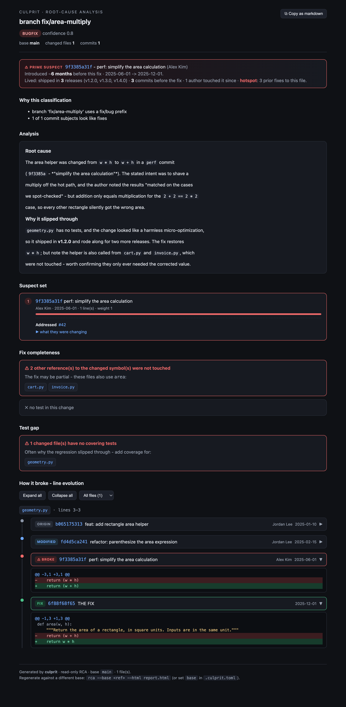

# culprit

<!-- mcp-name: io.github.noordeen123/culprit -->

[](https://github.com/noordeen123/culprit/actions/workflows/ci.yml)
[](https://pypi.org/project/culprit/)
[](https://pypi.org/project/culprit/)
[](LICENSE)

**The root-cause analysis engine for agent-driven development.** Your coding agent
(or subagent) uses culprit to find what introduced a bug and to verify its own fix
is complete before it commits.

Deterministic, offline, read-only. It never modifies your repo or PR, needs no API
key, and runs the same whether an agent calls it over MCP, you run it from the CLI,
or it gates a CI pipeline.

<p align="center">
  
</p>

## Why an agent needs this

An agent is good at writing a patch and bad at knowing whether the patch is *done*.
culprit closes that loop with git forensics an LLM cannot do reliably by reading
files:

- **Find the cause.** Given a regression (a fix, a branch, or a stack trace),
  culprit blames the changed lines back through refactors to rank the commits that
  introduced the bug, with the author's original intent and the releases it shipped
  in.
- **Verify the fix.** `verify_fix` checks a proposed diff before commit: does it
  miss other call sites of the changed symbol? Is there a test? It returns
  `complete` / `partial` / `risky`, so the agent iterates instead of shipping a
  half-fix.
- **Scope the blast radius.** For a feature change, culprit maps reverse-import
  dependents, covering tests, and the high-risk shared modules to exercise.

Every answer is structured JSON grounded in git, so the agent reasons over facts
instead of guessing.

## Install for agents

**Claude Code (plugin, recommended)** installs the MCP server and a skill that
tells the agent when to reach for it:

```bash
/plugin marketplace add noordeen123/culprit
/plugin install culprit@culprit
```

**Any MCP client** (Cursor, Windsurf, VS Code, Codex CLI, Zed, Continue, Cline,
Amazon Q, Goose, or any MCP SDK client). culprit is on the official MCP registry as
`io.github.noordeen123/culprit`. Add it to your client's config:

```json
{
  "mcpServers": {
    "culprit": {
      "command": "uvx",
      "args": ["--from", "culprit[mcp]", "culprit-mcp"]
    }
  }
}
```

Requires Python 3.10+ and [uv](https://docs.astral.sh/uv/) (`brew install uv`).

## The tools (11)

| Tool | What it answers |
|---|---|
| `analyze` | Full RCA in one call: classify, suspects or blast radius, risk, test impact |
| `verify_fix` | Is this diff safe to commit? `complete` / `partial` / `risky`, plus the missed call sites |
| `find_suspects` | Rank the commits that introduced the bug |
| `check_completeness` | Call sites of the changed symbol the fix did not touch |
| `get_intent` | The introducing commit's message, linked PR, referenced issues |
| `get_evolution` | Per-commit history of the buggy lines via `git log -L` |
| `get_risk_score` | QA gate score (0-100, low/medium/high) with contributing factors |
| `get_blast_radius` | Feature impact: dependents, covering tests, high-risk files |
| `get_test_impact` | Minimal test set to run for this change |
| `classify_change` | Bugfix vs feature, with evidence |
| `from_trace` | RCA straight from a stack trace, no diff or PR needed |

The plugin bundles a skill that routes the agent to these tools. For a non-plugin
setup or another agent, copy
[`examples/claude-code-skill/SKILL.md`](examples/claude-code-skill/SKILL.md) into
`.claude/skills/rca/`.

## verify_fix: the pre-commit gate

The hero for agent-driven work. The agent runs it on its own diff before
committing:

- `verdict`: `complete` (no untouched call site left behind), `partial` (a call
  site was missed), or `risky` (high risk). The verdict is the completeness axis;
  test coverage is the separate confidence axis on `risk_level`.
- `untouched_references`: other files that use the changed symbol but the fix did
  not touch. This is the list the agent goes and patches.
- `skipped_symbols`, `adds_test`, `notes`: what was too widely used to check by
  hand, whether a test shipped, and what to do next.

A clean, tested, fully-covered fix reads `complete` at low risk. A fix that patched
one of three call sites reads `partial`, and the agent knows exactly which files to
revisit, then re-runs until it is `complete` (the loop in the animation above).

## Accuracy

Suspect-finding is benchmarked against 50 real regressions (25 from
[git](https://github.com/git/git), 25 from
[systemd](https://github.com/systemd/systemd)), where the introducing commit is
known from each fix's `Fixes:` trailer (author-verified ground truth). culprit runs
exactly as you would: given only the fix commit, it blames the removed lines to rank
the commits that introduced the bug.

| Metric | Result |
|---|---|
| Introducing commit ranked #1 (top-1) | **50%** (25/50) |
| Introducing commit in the top-5 suspect set | **66%** (33/50) |

Fully deterministic and offline, on large C codebases the engine has never seen.
Reproduce with `python benchmarks/run.py`, which clones the repos and scores every
case.

## Also a CLI and a CI gate

Same engine, no agent required. Read-only either way.

```bash
uvx culprit                  # run from PyPI on demand, no install step
pip install culprit          # or install it
pipx install culprit         # isolated CLI
```

```bash
rca                            # current branch vs the configured base
rca --last                     # the latest commit only
rca --pr 16786                 # a specific PR (uses the PR's own base)
rca --trace crash.txt          # RCA from a stack trace, no fix or PR needed
rca --verify-fix patch.diff    # check a diff; exit 0 if complete, 1 otherwise
rca --select-tests             # print the tests to run for this change
rca --html report.html --open  # a single self-contained HTML report
rca --pr 16889 --fail-on high  # exit non-zero when QA risk is high (CI gate)
rca serve --repo /path         # local web UI with a base picker
```

**CI gate**, risk via exit code only, no PR comments, no writes. Copy
[`examples/github-actions/culprit-pr.yml`](examples/github-actions/culprit-pr.yml)
into `.github/workflows/`:

```yaml
- run: pip install "culprit>=0.3.0"
- env: { GH_TOKEN: "${{ github.token }}" }
  run: rca --pr ${{ github.event.pull_request.number }} --fail-on high
```

**HTML report** (`--html`): a single self-contained file, no CDN, opens offline.
For a bugfix it renders a line-evolution timeline, tracing each line the fix touched
from creation through the breaking commit (red) to the fix (green), with an intent
card, a lifecycle strip of the releases that shipped the bug, and deep links on
every commit, PR, and file.



**Config**: the base branch resolves in order from the `--base` flag, then
`CULPRIT_BASE`, then `.culprit.toml` (`base = "origin/main"`), then `HEAD~1`.
`--last` forces the latest-commit view. PR titles and labels use the GitHub CLI when
present, or the unauthenticated REST API for public repos (set `GITHUB_TOKEN` /
`GITLAB_TOKEN` to raise limits). Deep links cover GitHub, GitLab, Bitbucket, and
Gitea. Suspect-finding is language-agnostic (`git blame` / `log -L`); blast radius
reads imports across JS/TS, Python, Go, Java/Kotlin, Ruby, C/C++, C#, PHP, Rust,
Scala, Swift.

## vs `git bisect`

| | `git bisect` | culprit |
|---|---|---|
| Input | A reliable failing test | The fix diff (or a stack trace) |
| Method | Checks out commits and runs the test | Blames the fix's lines plus `git log -L` |
| Speed | Minutes (about log2(N) test runs) | Instant |
| Output | First bad commit | Suspect set, line evolution, intent, lifecycle, completeness, risk |
| Confidence | Proof | Strong heuristic |

`--bisect "<cmd>"` runs a real bisect as an optional confirmation layer, in a
throwaway `git worktree` so your checkout is never touched. When the first failing
commit matches the blamed suspect, the HTML report stamps it **confirmed by git
bisect**.

## Architecture

The deterministic git work (diff parsing, `git blame` / `git log -L`, suspect set,
reverse-import map) emits structured JSON. The optional LLM narrative is isolated
behind a `ReasoningAdapter`: `HarnessAdapter` for Claude Code (no key needed),
`ClaudeAPIAdapter` for standalone use. Full module map and data shapes:
[`docs/ARCHITECTURE.md`](docs/ARCHITECTURE.md).

## Tests

```bash
pip install -e ".[dev]" && pytest
```
